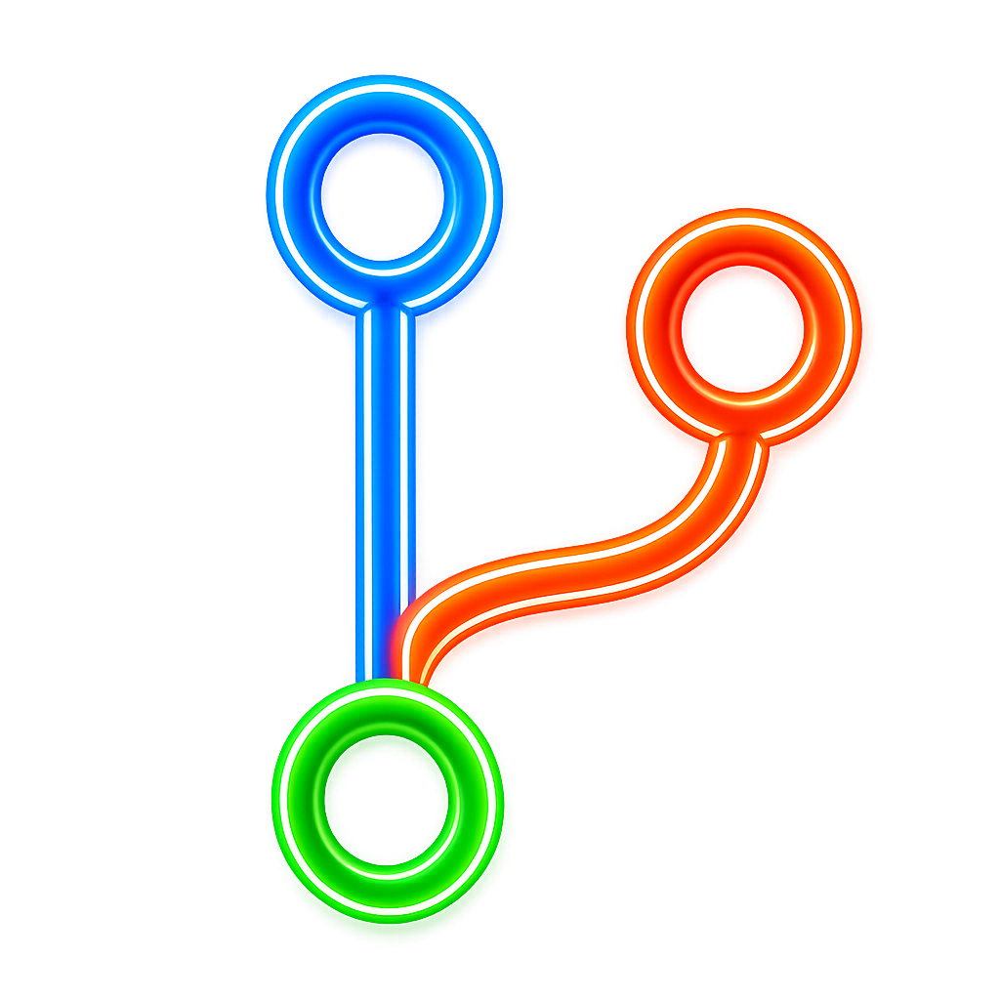
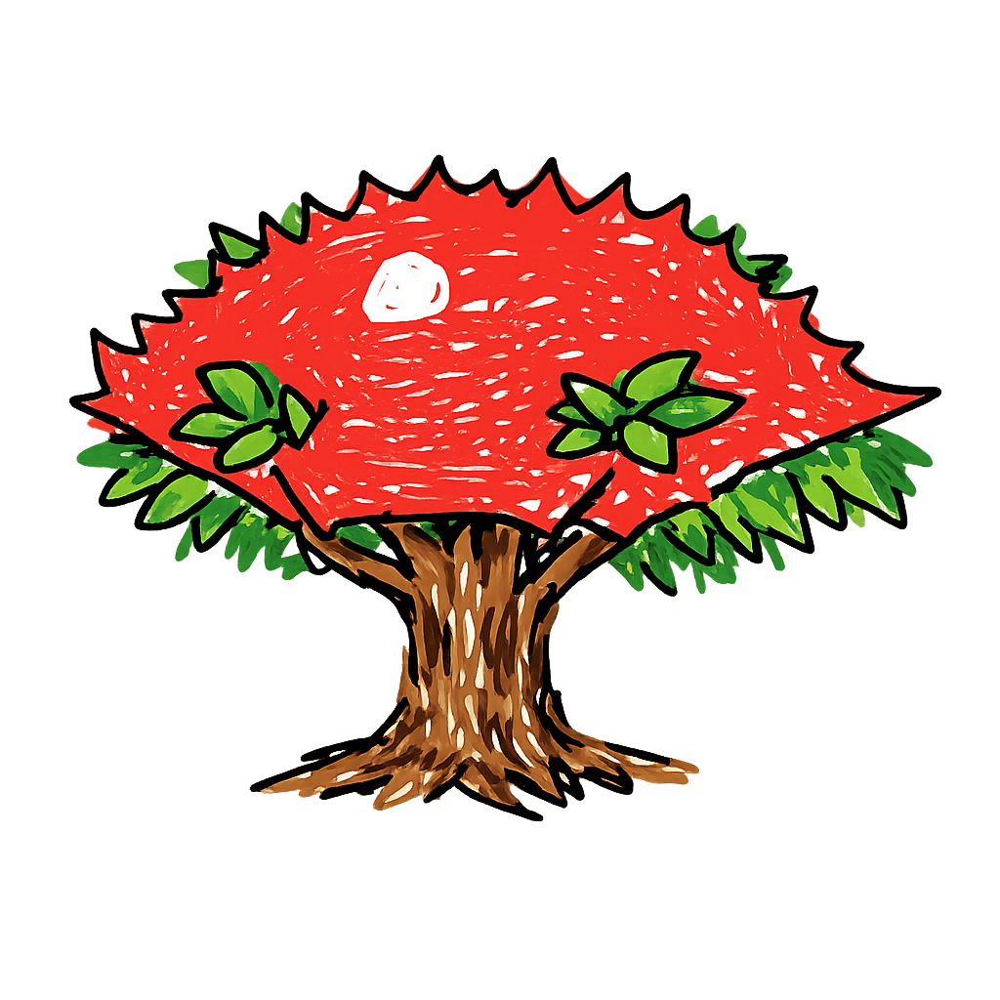

# Welcome to Crabtree!

<table>
  <tr>
    <td>
      
    </td>
    <td>
      
    </td>
    <td>
      
    </td>
    <td>
      
    </td>
  </tr>
</table>

It's easy to spin up 100 worktrees in Codex, but merging them back together is hard. Crabtree was built to fix that.

[Crabtree](https://crabtree.app) is a desktop app that lets you manage your Codex chats, worktrees, and branches in one place. Branch, commit, merge, and push, without fumbling with Codex or Cursor.

## Contributing

Feel free to submit an [Issue](https://github.com/glassdevtools/crabtree/issues) for suggestions. 

## Download

Download Crabtree on our website: https://crabtree.app.

	

