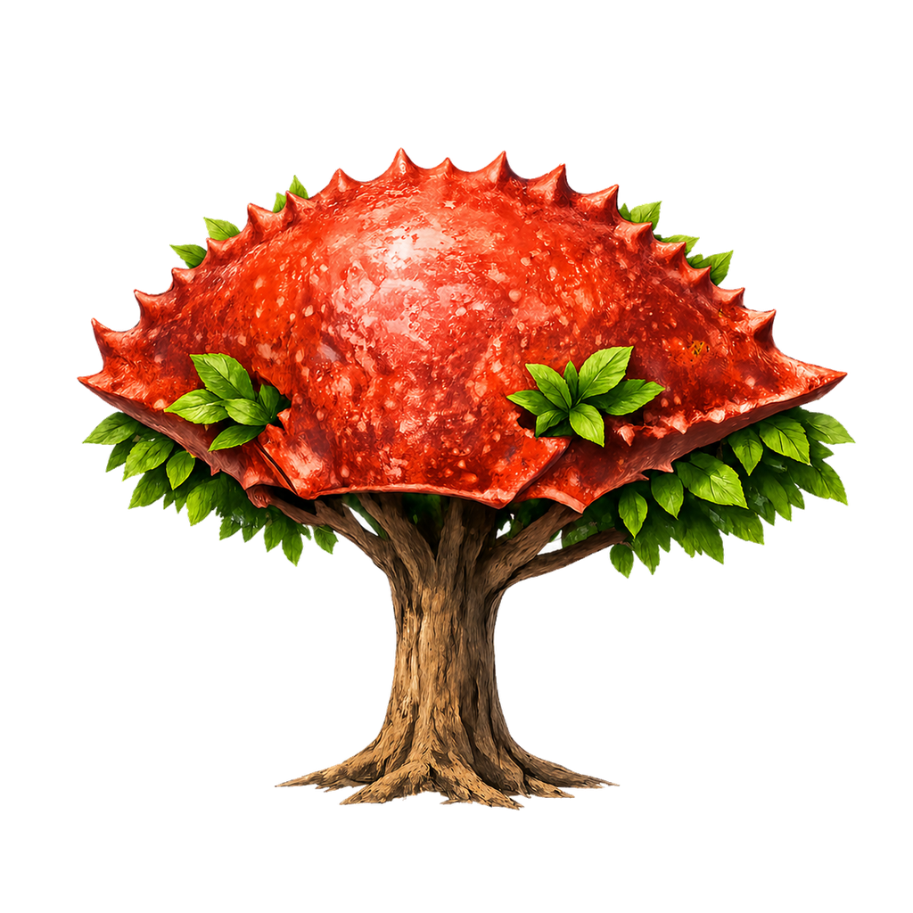
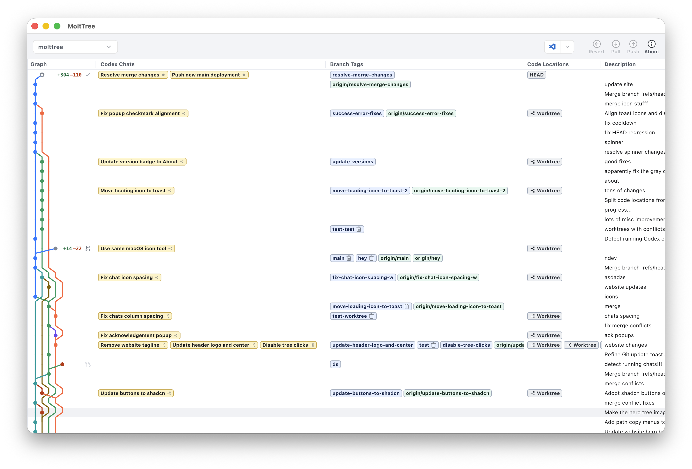

# Welcome to MoltTree!

	

It's easy to spin up 100 worktrees in Codex, but merging them back together is hard. MoltTree was built to fix that.

[MoltTree](https://molttree.app) is a desktop app that lets you manage your Codex chats, worktrees, and branches in one place. It organizes all your commits (including worktrees!), and gives you Git power tools to branch, commit, merge, and push, all without using your IDE or fumbling with Codex or Cursor. 

## Contributing

Feel free to submit an [Issue](https://github.com/glassdevtools/molttree/issues) for suggestions and bugs. For safety reasons I won't be accepting PRs in most cases, but I will happily accept "Prompt Requests".

## Download

Download MoltTree on our [Website](https://molttree.app).

	

